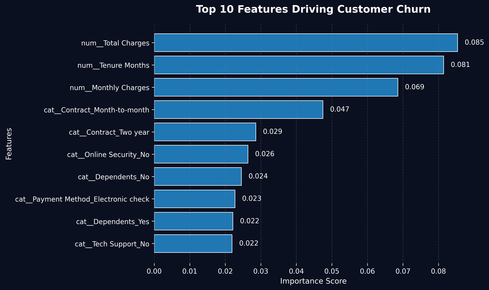

# 📊 Customer Churn Prediction App

A modern **machine learning + interactive dashboard** that predicts whether a customer is likely to churn, built with:

* 🧠 Machine Learning (Random Forest)
* 📊 Data Analysis & Feature Engineering
* 🌐 Streamlit (Interactive UI)
* 📈 Plotly (Interactive Visualizations)

---

## 🚀 Live Features

✅ Predict customer churn risk
✅ Interactive input dashboard
✅ Real-time probability output
✅ Business-style risk insights
✅ Feature importance visualization (interactive)

---

## 🧠 How It Works

1. User inputs customer data (tenure, billing, services, etc.)
2. Data is processed using the same pipeline as training
3. Model predicts:

   * **Churn (1)** or **Stay (0)**
   * Probability score
4. App displays:

   * Prediction result
   * Risk insights
   * Feature importance chart

---

## 📸 Preview

### 🔮 Prediction Interface


### 📊 Feature Importance (Interactive in App)



---

## 📁 Project Structure

```
customer-churn-prediction/
│
├── data/                     # Dataset
├── notebooks/               # EDA & experimentation
├── src/                     # Core ML pipeline
│   ├── preprocess.py
│   ├── train.py
│   └── predict.py
│
├── app/                     # Streamlit app
│   └── streamlit_app.py
│
├── outputs/
│   ├── figures/             # Charts & visuals
│   └── models/              # Saved model
│
├── requirements.txt
└── README.md
```

---

## 🧪 Model Details

* Algorithm: **Random Forest Classifier**
* Task: Binary Classification (Churn / No Churn)
* Evaluation Metrics:

  * Accuracy: ~80%
  * ROC-AUC: ~0.83
  * F1-score: Balanced performance

---

## 📊 Key Insights

Top drivers of churn include:

* Total Charges
* Tenure
* Monthly Charges
* Contract Type
* Online Security
* Tech Support

---

## ⚙️ Installation & Setup

### 1️⃣ Clone the repo

```bash
git clone https://github.com/Turkishangoras/customer-churn-prediction.git
cd customer-churn-prediction
```

---

### 2️⃣ Create virtual environment

```bash
python -m venv .venv
source .venv/bin/activate   # Mac/Linux
```

---

### 3️⃣ Install dependencies

```bash
pip install -r requirements.txt
```

---

### 4️⃣ Train the model

```bash
python src/train.py
```

---

### 5️⃣ Run the app

```bash
python -m streamlit run app/streamlit_app.py
```

---

## 🧠 Tech Stack

* Python
* Pandas
* Scikit-learn
* Matplotlib
* Plotly
* Streamlit

---

## 💡 Future Improvements

* 🔥 Deploy app online (Streamlit Cloud / Render)
* 📊 Add customer segmentation
* 🤖 Try advanced models (XGBoost, LightGBM)
* 📈 Add SHAP explainability

---

## 👨‍💻 Author

**Ali Nawwaf Fathuhy**

* GitHub: https://github.com/Turkishangoras

---

## ⭐ Why This Project Matters

This project demonstrates:

* End-to-end ML pipeline
* Real-world dataset handling
* Model evaluation & optimization
* UI + ML integration
* Clean project structure (production-ready)

---

⭐ If you like this project, feel free to star it!
